

## Pascual Barrer Ferrer

# Apartado a)

En este apartado se nos pide que, a partir de un repositorio remoto ya existente, lo clonemos en local, hagamos cambios y los publiquemos en remoto.

Como repositorio remoto escogemos el mismo que usamos para la tarea 3 (el `hello-world`).

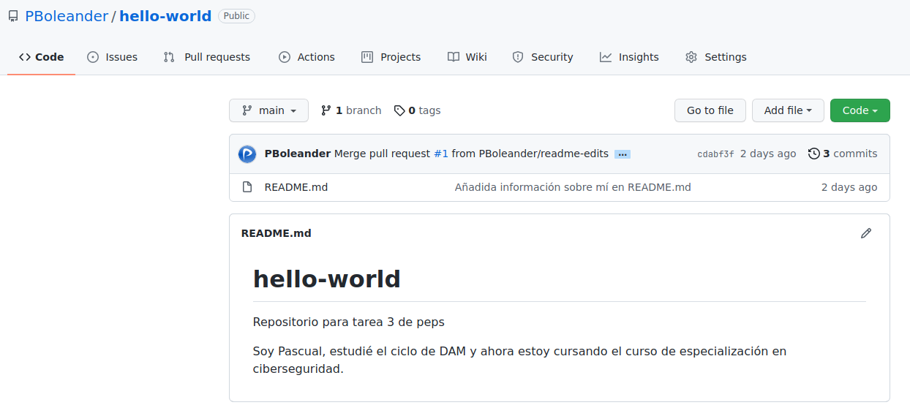

Nos disponemos a clonarlo en otro directorio al que ya lo teníamos clonado anteriormente y, para ello, buscamos la dirección en la que se encuentra pulsando sobre el botón verde Code. Copiamos la dirección (en SSH porque yo tengo un par de claves SSH configurado en mi cuenta GitHub y ordenador; si no se tiene se elegiría la opción en HTTPS).

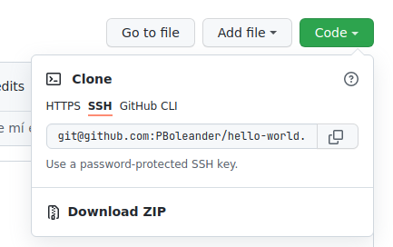

Nos dirigimos a la terminal y hacemos un `git clone` con la dirección recién copiada. Esto nos crea una carpeta con el nombre del repositorio (`hello-world`). Nos cambiamos a ella con un `cd` y creamos la nueva rama para realizar cambios de manera segura, es decir, sin tocar la rama principal hasta que no estemos seguros de que las modificaciones no introducen errores, bugs, etc. La creación de la rama se realiza mediante un `git branch <nombre-rama>` y nos cambiamos a ella con `git checkout`.

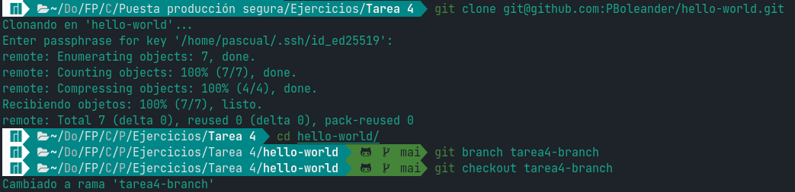

Una vez allí, nos disponemos a modificar el archivo README.md que, de hecho, es el único que hay. Abrimos nuestro editor favorito y añadimos/borramos las líneas que creemos oportunas.

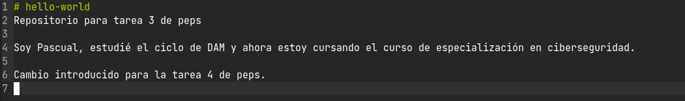

Cuando hemos guardado los cambios nos disponemos a informar a `git` de esas modificaciones mediante un `git add` y, además, un `git commit`. A través de un `push` hacemos que estos cambios sean trasladados al remoto. Los cambios los añadimos a la rama `tarea4-branch` remota mediante ese último comando.

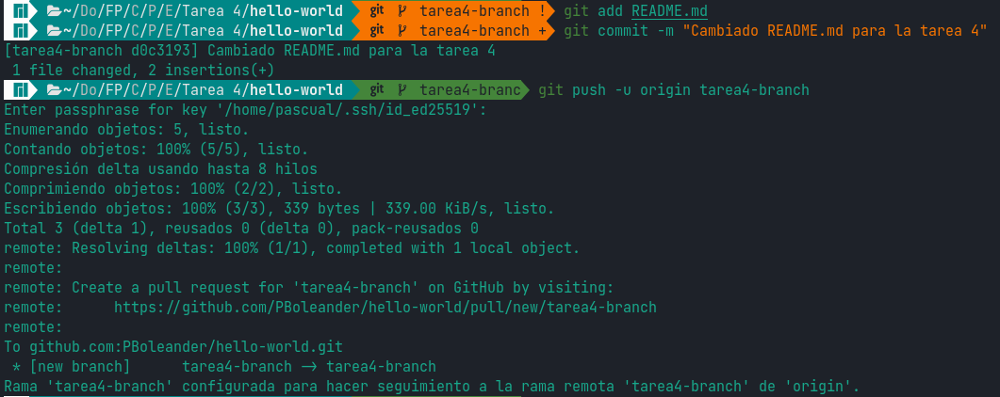

Al ir a nuestro repositorio remoto en GitHub vemos como, efectivamente, los cambios se han realizado (véase el rectángulo amarillento que nos informa de la nueva rama).

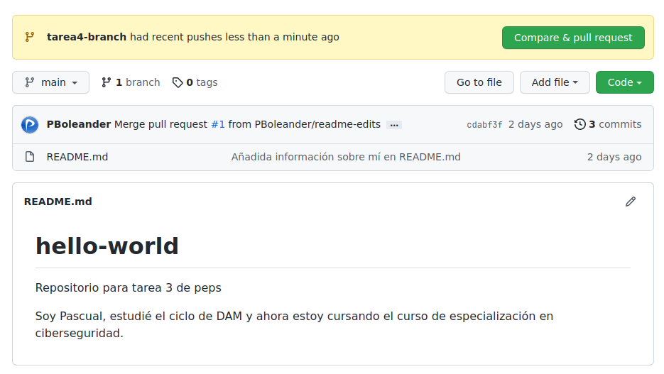

Si queremos que estos cambios pasen a producción (rama `main`) tendremos que hacer un `pull request`. No explicaremos este proceso con detalle ya que lo hicimos en la tarea 3.

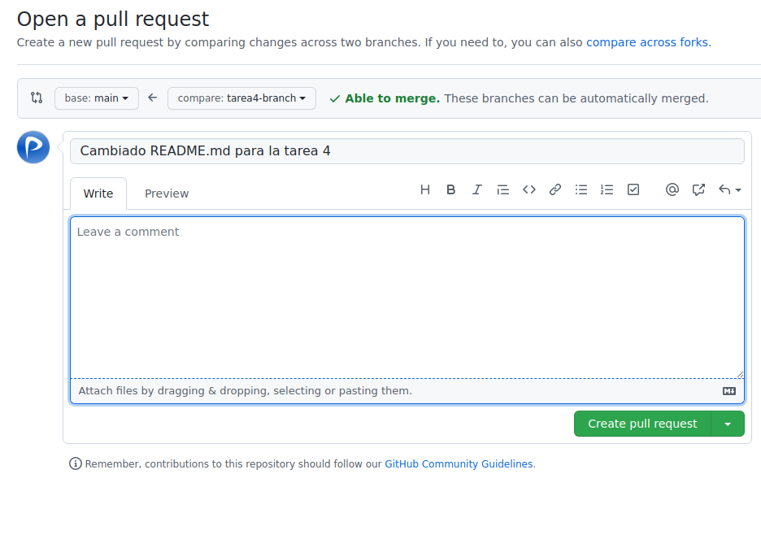

En la misma ventana que la imagen anterior, si hacemos *scroll* podremos ver los cambios realizados.

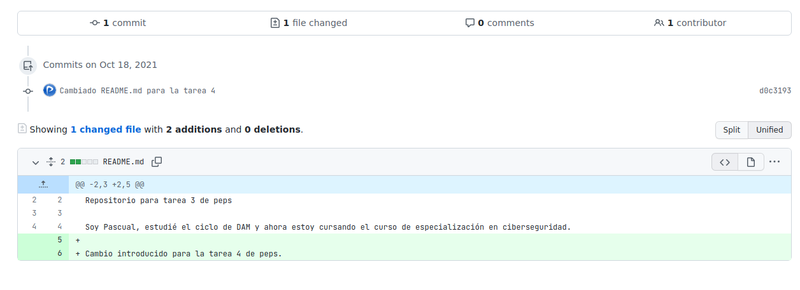

Cuando creamos el `pull request` nos da la opción de unir las ramas `main` y `tarea4-branch` ya que el repositorio es nuestro. Lo hacemos.

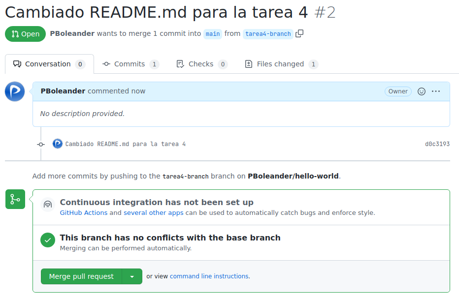

Le damos a confirmar.

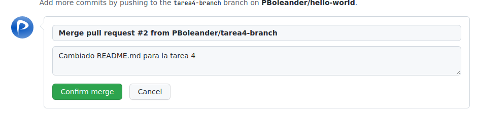

Una vez unidas, podemos borrar la rama `tarea4-branch` al ser igual a la `main`.

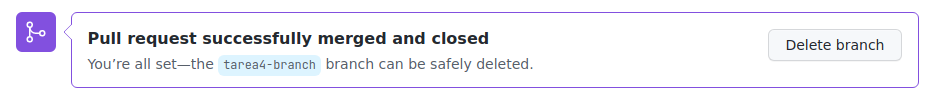

Como podemos observar, los cambios ya están en producción.

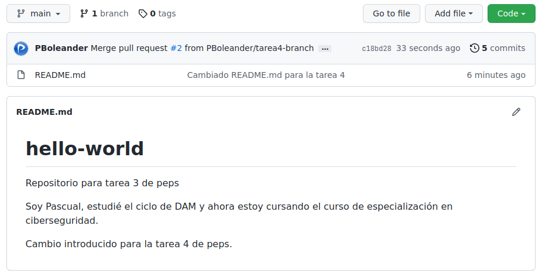

# Apartado b)

En esta ocasión se nos pide que creemos un repositorio nuevo, hagamos cambios en él y lo subamos a remoto.

Para ello tenemos que crear un repositorio en GitHub ya que eso no puede hacer desde la consola. Así que lo hacemos tal y como hicimos en la tarea 3.

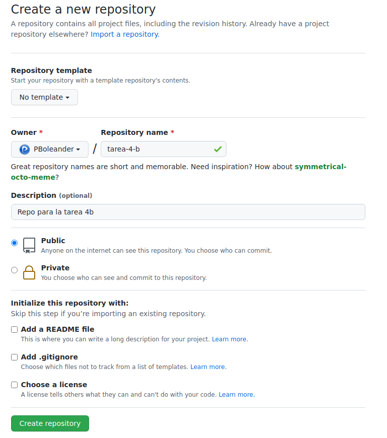

En consola, ejecutamos `git init` para iniciar un repositorio `git` en local y, allí, creamos un archivo README.md y lo registramos en `git` mediante el ya conocido `git add` y `git commit`.

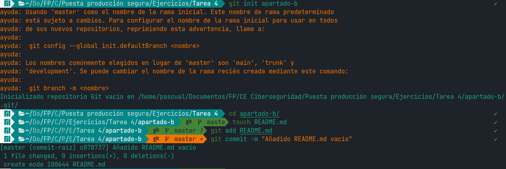

Cuando creamos el repositorio en GitHub nos da la dirección que hemos de copiar para añadirlo como remoto en nuestro repositorio local.

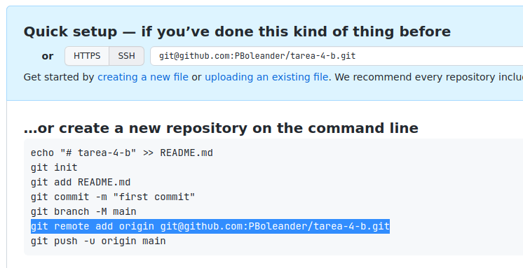

Vamos a la terminal y ejecutamos `git remote add origin` seguido de la dirección que hemos copiado. Ahora nuestro repositorio local ya sabe hacia donde apuntar cuando hagamos `push` y `pull`. Como que hemos añadido un archivo que ya está en seguimiento, lo mandamos al remoto con `git push`.

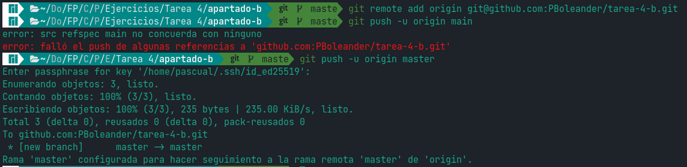

Al actualizar la página de GitHub encontramos los cambios hechos en local como pretendíamos.

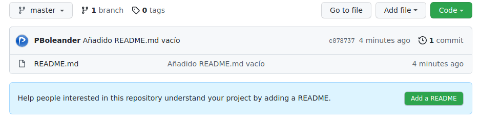